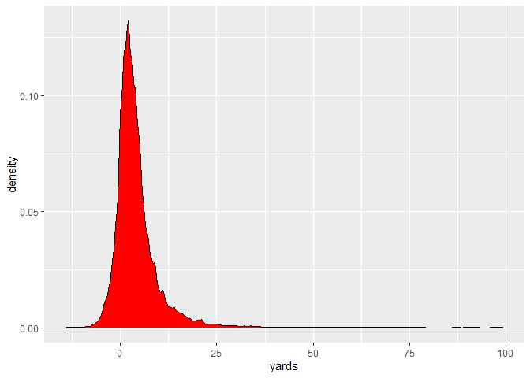
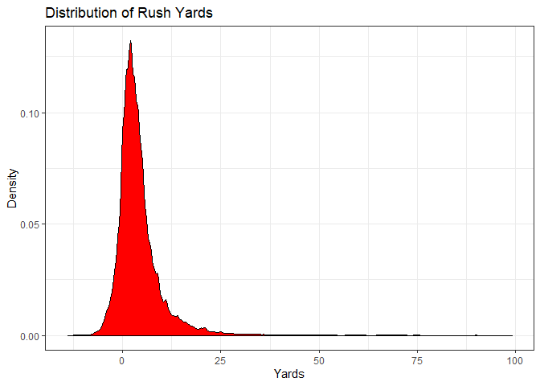
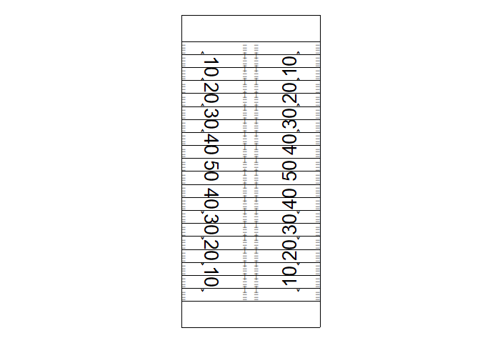
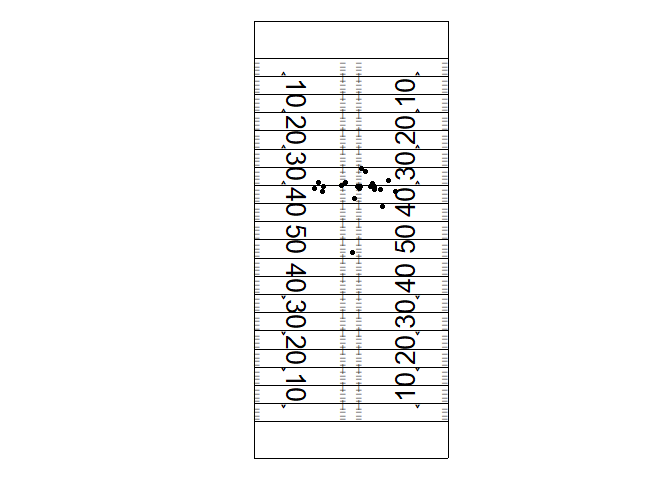
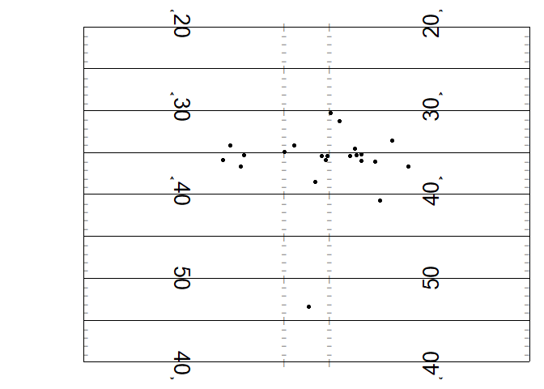
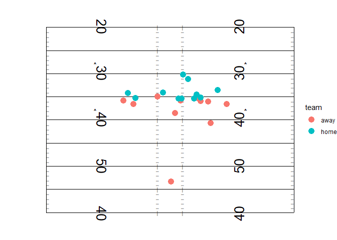

Here is the [link](https://www.kaggle.com/c/nfl-big-data-bowl-2020/overview) to the Kaggle competition.

The goal of this competition is to predict the number of yards gained on a play given spatial information about the play at the time of hand off and other information about the play. 

First lets load some libraries


```r
# install.packages("tidyverse")
# install.packages("snakecase")

library(tidyverse)
library(snakecase)
```


Now let's read in the data. First make sure you store the data in a folder called data. You can dowload the data from [here](https://www.kaggle.com/c/nfl-big-data-bowl-2020/data).


```r
data <- 
  read_csv("data/train.csv")
```

```
## Parsed with column specification:
## cols(
##   .default = col_double(),
##   Team = col_character(),
##   DisplayName = col_character(),
##   GameClock = col_time(format = ""),
##   PossessionTeam = col_character(),
##   FieldPosition = col_character(),
##   OffenseFormation = col_character(),
##   OffensePersonnel = col_character(),
##   DefensePersonnel = col_character(),
##   PlayDirection = col_character(),
##   TimeHandoff = col_datetime(format = ""),
##   TimeSnap = col_datetime(format = ""),
##   PlayerHeight = col_character(),
##   PlayerBirthDate = col_character(),
##   PlayerCollegeName = col_character(),
##   Position = col_character(),
##   HomeTeamAbbr = col_character(),
##   VisitorTeamAbbr = col_character(),
##   Stadium = col_character(),
##   Location = col_character(),
##   StadiumType = col_character()
##   # ... with 3 more columns
## )
```

```
## See spec(...) for full column specifications.
```

```
## Warning: 16500 parsing failures.
##   row       col expected actual             file
## 47983 WindSpeed a double    SSW 'data/train.csv'
## 47984 WindSpeed a double    SSW 'data/train.csv'
## 47985 WindSpeed a double    SSW 'data/train.csv'
## 47986 WindSpeed a double    SSW 'data/train.csv'
## 47987 WindSpeed a double    SSW 'data/train.csv'
## ..... ......... ........ ...... ................
## See problems(...) for more details.
```

Notice how we got some warning about the WindSpeed column? That's because `read_csv` is guessing that WindSpeed is a number when sometimes it is a string. Let's tell `read_csv` that we have a character column.


```r
data <- 
  read_csv("data/train.csv", col_types = list(WindSpeed = col_character()))
```

Now let's rename our columns so that they all have the same naming format. I can do this by renaming all the columns at once using the `rename_all` function. What we are doing is applying the `to_snake_case` function to each column name and then overwriting the old column name with the new one.


```r
data <-
  data %>%
  rename_all(to_snake_case)
```

Now let's look at our data


```r
data
```

```
## # A tibble: 509,762 x 49
##    game_id play_id team      x     y     s     a   dis orientation   dir
##      <dbl>   <dbl> <chr> <dbl> <dbl> <dbl> <dbl> <dbl>       <dbl> <dbl>
##  1  2.02e9 2.02e13 away   73.9  34.8  1.69  1.13  0.4        82.0  177. 
##  2  2.02e9 2.02e13 away   74.7  32.6  0.42  1.35  0.01       27.6  199. 
##  3  2.02e9 2.02e13 away   74    33.2  1.22  0.59  0.31        3.01 203. 
##  4  2.02e9 2.02e13 away   71.5  27.7  0.42  0.54  0.02      360.   106. 
##  5  2.02e9 2.02e13 away   69.3  35.4  1.82  2.43  0.16       12.6  164. 
##  6  2.02e9 2.02e13 away   75.1  24    1.01  0.32  0.18      308.    95.0
##  7  2.02e9 2.02e13 away   74.1  16.6  1.11  0.83  0.02      357.   323. 
##  8  2.02e9 2.02e13 away   73.4  18.7  1.24  0.74  0.13      329.   270. 
##  9  2.02e9 2.02e13 away   56.6  26.9  0.26  1.86  0.28      345.    55.3
## 10  2.02e9 2.02e13 away   73.4  38.8  4.55  0.76  0.51       75.5  191. 
## # ... with 509,752 more rows, and 39 more variables: nfl_id <dbl>,
## #   display_name <chr>, jersey_number <dbl>, season <dbl>,
## #   yard_line <dbl>, quarter <dbl>, game_clock <time>,
## #   possession_team <chr>, down <dbl>, distance <dbl>,
## #   field_position <chr>, home_score_before_play <dbl>,
## #   visitor_score_before_play <dbl>, nfl_id_rusher <dbl>,
## #   offense_formation <chr>, offense_personnel <chr>,
## #   defenders_in_the_box <dbl>, defense_personnel <chr>,
## #   play_direction <chr>, time_handoff <dttm>, time_snap <dttm>,
## #   yards <dbl>, player_height <chr>, player_weight <dbl>,
## #   player_birth_date <chr>, player_college_name <chr>, position <chr>,
## #   home_team_abbr <chr>, visitor_team_abbr <chr>, week <dbl>,
## #   stadium <chr>, location <chr>, stadium_type <chr>, turf <chr>,
## #   game_weather <chr>, temperature <dbl>, humidity <dbl>,
## #   wind_speed <chr>, wind_direction <chr>
```

Notice how we can only see some of the columns. We will use the `glimpse` function to take a look at the types of each column and some sample observations.


```r
data %>%
  glimpse()
```

```
## Observations: 509,762
## Variables: 49
## $ game_id                   <dbl> 2017090700, 2017090700, 2017090700, ...
## $ play_id                   <dbl> 2.017091e+13, 2.017091e+13, 2.017091...
## $ team                      <chr> "away", "away", "away", "away", "awa...
## $ x                         <dbl> 73.91, 74.67, 74.00, 71.46, 69.32, 7...
## $ y                         <dbl> 34.84, 32.64, 33.20, 27.70, 35.42, 2...
## $ s                         <dbl> 1.69, 0.42, 1.22, 0.42, 1.82, 1.01, ...
## $ a                         <dbl> 1.13, 1.35, 0.59, 0.54, 2.43, 0.32, ...
## $ dis                       <dbl> 0.40, 0.01, 0.31, 0.02, 0.16, 0.18, ...
## $ orientation               <dbl> 81.99, 27.61, 3.01, 359.77, 12.63, 3...
## $ dir                       <dbl> 177.18, 198.70, 202.73, 105.64, 164....
## $ nfl_id                    <dbl> 496723, 2495116, 2495493, 2506353, 2...
## $ display_name              <chr> "Eric Berry", "Allen Bailey", "Justi...
## $ jersey_number             <dbl> 29, 97, 50, 56, 38, 55, 39, 23, 49, ...
## $ season                    <dbl> 2017, 2017, 2017, 2017, 2017, 2017, ...
## $ yard_line                 <dbl> 35, 35, 35, 35, 35, 35, 35, 35, 35, ...
## $ quarter                   <dbl> 1, 1, 1, 1, 1, 1, 1, 1, 1, 1, 1, 1, ...
## $ game_clock                <time> 14:14:00, 14:14:00, 14:14:00, 14:14...
## $ possession_team           <chr> "NE", "NE", "NE", "NE", "NE", "NE", ...
## $ down                      <dbl> 3, 3, 3, 3, 3, 3, 3, 3, 3, 3, 3, 3, ...
## $ distance                  <dbl> 2, 2, 2, 2, 2, 2, 2, 2, 2, 2, 2, 2, ...
## $ field_position            <chr> "NE", "NE", "NE", "NE", "NE", "NE", ...
## $ home_score_before_play    <dbl> 0, 0, 0, 0, 0, 0, 0, 0, 0, 0, 0, 0, ...
## $ visitor_score_before_play <dbl> 0, 0, 0, 0, 0, 0, 0, 0, 0, 0, 0, 0, ...
## $ nfl_id_rusher             <dbl> 2543773, 2543773, 2543773, 2543773, ...
## $ offense_formation         <chr> "SHOTGUN", "SHOTGUN", "SHOTGUN", "SH...
## $ offense_personnel         <chr> "1 RB, 1 TE, 3 WR", "1 RB, 1 TE, 3 W...
## $ defenders_in_the_box      <dbl> 6, 6, 6, 6, 6, 6, 6, 6, 6, 6, 6, 6, ...
## $ defense_personnel         <chr> "2 DL, 3 LB, 6 DB", "2 DL, 3 LB, 6 D...
## $ play_direction            <chr> "left", "left", "left", "left", "lef...
## $ time_handoff              <dttm> 2017-09-08 00:44:06, 2017-09-08 00:...
## $ time_snap                 <dttm> 2017-09-08 00:44:05, 2017-09-08 00:...
## $ yards                     <dbl> 8, 8, 8, 8, 8, 8, 8, 8, 8, 8, 8, 8, ...
## $ player_height             <chr> "6-0", "6-3", "6-3", "6-3", "6-0", "...
## $ player_weight             <dbl> 212, 288, 270, 245, 206, 252, 190, 1...
## $ player_birth_date         <chr> "12/29/1988", "03/25/1989", "01/21/1...
## $ player_college_name       <chr> "Tennessee", "Miami", "Georgia", "Te...
## $ position                  <chr> "SS", "DE", "DE", "ILB", "FS", "DE",...
## $ home_team_abbr            <chr> "NE", "NE", "NE", "NE", "NE", "NE", ...
## $ visitor_team_abbr         <chr> "KC", "KC", "KC", "KC", "KC", "KC", ...
## $ week                      <dbl> 1, 1, 1, 1, 1, 1, 1, 1, 1, 1, 1, 1, ...
## $ stadium                   <chr> "Gillette Stadium", "Gillette Stadiu...
## $ location                  <chr> "Foxborough, MA", "Foxborough, MA", ...
## $ stadium_type              <chr> "Outdoor", "Outdoor", "Outdoor", "Ou...
## $ turf                      <chr> "Field Turf", "Field Turf", "Field T...
## $ game_weather              <chr> "Clear and warm", "Clear and warm", ...
## $ temperature               <dbl> 63, 63, 63, 63, 63, 63, 63, 63, 63, ...
## $ humidity                  <dbl> 77, 77, 77, 77, 77, 77, 77, 77, 77, ...
## $ wind_speed                <chr> "8", "8", "8", "8", "8", "8", "8", "...
## $ wind_direction            <chr> "SW", "SW", "SW", "SW", "SW", "SW", ...
```

This is the second time I've used the `%>%` (pipe). As you read code you can think of it as the English word *then*. It is very powerful in making long code sentences that are more readable. What it does is takes the output of the thing to it's left and makes it the first argument in the next function. 

To illustrate this point we can run the `glimpse` function with data inside the parathesis. We can see that this output is the same as the one above.


```r
glimpse(data)
```

```
## Observations: 509,762
## Variables: 49
## $ game_id                   <dbl> 2017090700, 2017090700, 2017090700, ...
## $ play_id                   <dbl> 2.017091e+13, 2.017091e+13, 2.017091...
## $ team                      <chr> "away", "away", "away", "away", "awa...
## $ x                         <dbl> 73.91, 74.67, 74.00, 71.46, 69.32, 7...
## $ y                         <dbl> 34.84, 32.64, 33.20, 27.70, 35.42, 2...
## $ s                         <dbl> 1.69, 0.42, 1.22, 0.42, 1.82, 1.01, ...
## $ a                         <dbl> 1.13, 1.35, 0.59, 0.54, 2.43, 0.32, ...
## $ dis                       <dbl> 0.40, 0.01, 0.31, 0.02, 0.16, 0.18, ...
## $ orientation               <dbl> 81.99, 27.61, 3.01, 359.77, 12.63, 3...
## $ dir                       <dbl> 177.18, 198.70, 202.73, 105.64, 164....
## $ nfl_id                    <dbl> 496723, 2495116, 2495493, 2506353, 2...
## $ display_name              <chr> "Eric Berry", "Allen Bailey", "Justi...
## $ jersey_number             <dbl> 29, 97, 50, 56, 38, 55, 39, 23, 49, ...
## $ season                    <dbl> 2017, 2017, 2017, 2017, 2017, 2017, ...
## $ yard_line                 <dbl> 35, 35, 35, 35, 35, 35, 35, 35, 35, ...
## $ quarter                   <dbl> 1, 1, 1, 1, 1, 1, 1, 1, 1, 1, 1, 1, ...
## $ game_clock                <time> 14:14:00, 14:14:00, 14:14:00, 14:14...
## $ possession_team           <chr> "NE", "NE", "NE", "NE", "NE", "NE", ...
## $ down                      <dbl> 3, 3, 3, 3, 3, 3, 3, 3, 3, 3, 3, 3, ...
## $ distance                  <dbl> 2, 2, 2, 2, 2, 2, 2, 2, 2, 2, 2, 2, ...
## $ field_position            <chr> "NE", "NE", "NE", "NE", "NE", "NE", ...
## $ home_score_before_play    <dbl> 0, 0, 0, 0, 0, 0, 0, 0, 0, 0, 0, 0, ...
## $ visitor_score_before_play <dbl> 0, 0, 0, 0, 0, 0, 0, 0, 0, 0, 0, 0, ...
## $ nfl_id_rusher             <dbl> 2543773, 2543773, 2543773, 2543773, ...
## $ offense_formation         <chr> "SHOTGUN", "SHOTGUN", "SHOTGUN", "SH...
## $ offense_personnel         <chr> "1 RB, 1 TE, 3 WR", "1 RB, 1 TE, 3 W...
## $ defenders_in_the_box      <dbl> 6, 6, 6, 6, 6, 6, 6, 6, 6, 6, 6, 6, ...
## $ defense_personnel         <chr> "2 DL, 3 LB, 6 DB", "2 DL, 3 LB, 6 D...
## $ play_direction            <chr> "left", "left", "left", "left", "lef...
## $ time_handoff              <dttm> 2017-09-08 00:44:06, 2017-09-08 00:...
## $ time_snap                 <dttm> 2017-09-08 00:44:05, 2017-09-08 00:...
## $ yards                     <dbl> 8, 8, 8, 8, 8, 8, 8, 8, 8, 8, 8, 8, ...
## $ player_height             <chr> "6-0", "6-3", "6-3", "6-3", "6-0", "...
## $ player_weight             <dbl> 212, 288, 270, 245, 206, 252, 190, 1...
## $ player_birth_date         <chr> "12/29/1988", "03/25/1989", "01/21/1...
## $ player_college_name       <chr> "Tennessee", "Miami", "Georgia", "Te...
## $ position                  <chr> "SS", "DE", "DE", "ILB", "FS", "DE",...
## $ home_team_abbr            <chr> "NE", "NE", "NE", "NE", "NE", "NE", ...
## $ visitor_team_abbr         <chr> "KC", "KC", "KC", "KC", "KC", "KC", ...
## $ week                      <dbl> 1, 1, 1, 1, 1, 1, 1, 1, 1, 1, 1, 1, ...
## $ stadium                   <chr> "Gillette Stadium", "Gillette Stadiu...
## $ location                  <chr> "Foxborough, MA", "Foxborough, MA", ...
## $ stadium_type              <chr> "Outdoor", "Outdoor", "Outdoor", "Ou...
## $ turf                      <chr> "Field Turf", "Field Turf", "Field T...
## $ game_weather              <chr> "Clear and warm", "Clear and warm", ...
## $ temperature               <dbl> 63, 63, 63, 63, 63, 63, 63, 63, 63, ...
## $ humidity                  <dbl> 77, 77, 77, 77, 77, 77, 77, 77, 77, ...
## $ wind_speed                <chr> "8", "8", "8", "8", "8", "8", "8", "...
## $ wind_direction            <chr> "SW", "SW", "SW", "SW", "SW", "SW", ...
```

Let's get to some Football!

So our data contains one row for every player on every play. So if we count the number of rows for each play on each game we should see 22 rows.


```r
data %>% 
  count(game_id, play_id)
```

```
## # A tibble: 23,171 x 3
##       game_id play_id     n
##         <dbl>   <dbl> <int>
##  1 2017090700 2.02e13    22
##  2 2017090700 2.02e13    22
##  3 2017090700 2.02e13    22
##  4 2017090700 2.02e13    22
##  5 2017090700 2.02e13    22
##  6 2017090700 2.02e13    22
##  7 2017090700 2.02e13    22
##  8 2017090700 2.02e13    22
##  9 2017090700 2.02e13    22
## 10 2017090700 2.02e13    22
## # ... with 23,161 more rows
```

This checks out.

Now if we remove the columns that describe players and only look at the ones that describe the play we should see 1 row for play.

Note the `distinct` function here keeps only 1 of every duplicate row.


```r
data %>% 
  select(game_id, play_id, season:yards, home_team_abbr:wind_direction) %>%
  distinct() %>%
  count(game_id, play_id)
```

```
## # A tibble: 23,171 x 3
##       game_id play_id     n
##         <dbl>   <dbl> <int>
##  1 2017090700 2.02e13     1
##  2 2017090700 2.02e13     1
##  3 2017090700 2.02e13     1
##  4 2017090700 2.02e13     1
##  5 2017090700 2.02e13     1
##  6 2017090700 2.02e13     1
##  7 2017090700 2.02e13     1
##  8 2017090700 2.02e13     1
##  9 2017090700 2.02e13     1
## 10 2017090700 2.02e13     1
## # ... with 23,161 more rows
```

So this looked like it worked. But what if theres a weird play that is not at the top of our list.


```r
data %>% 
  select(game_id, play_id, season:yards, home_team_abbr:wind_direction) %>%
  distinct() %>%
  count(game_id, play_id) %>%
  filter(n != 1)
```

```
## # A tibble: 0 x 3
## # ... with 3 variables: game_id <dbl>, play_id <dbl>, n <int>
```

There are no plays with more than 1 row. This is good!

Let's save this play level data in a new `tibble` (a special type of dataframe).


```r
play_level_data <-
  data %>% 
  select(game_id, play_id, season:yards, home_team_abbr:wind_direction) %>%
  distinct()
```

Lets make a plot to understand our response variable. The `yards` variable is the outcome from each play. Let's look at the distribution of rush yards. We can see that every once in a while we lose yardage, overwhelmingly the yardage gained is small, and sometimes there are large gains (ex. 75 yards).


```r
play_level_data %>%
  ggplot(aes(x = yards)) +
  geom_density(fill = "red")
```

<!-- -->

This is a ggplot objec we can add features to it using `+` and new ggplot layers


```r
play_level_data %>%
  ggplot(aes(x = yards)) +
  geom_density(fill = "red") +
  labs(x = "Yards",
       y = "Density",
       title = "Distribution of Rush Yards")
```

<!-- -->

Let's make it a little prettier


```r
play_level_data %>%
  ggplot(aes(x = yards)) +
  geom_density(fill = "red") +
  labs(x = "Yards",
       y = "Density",
       title = "Distribution of Rush Yards") +
  theme_bw()
```

<!-- -->

Now let's see if we can make a plot that takes into account the spatial location of the players.

I've included a helper function to get us started we won't look at that until later. It gives us a function which we can use to help our plot.


```r
source("helper_functions/plot_field.R")
```

Let's plot the football field.


```r
plot_field(y_min = 0, y_max = 120)
```

<!-- -->

Now lets try and plot one play on the field.


```r
one_play <-
  data %>%
  group_by(game_id, play_id) %>%
  filter(group_indices() == 1)
```

We should make sure we have 22 observations (1 for each player).


```r
one_play %>%
  nrow()
```

```
## [1] 22
```

Great let's keep it moving. Let's plot a dot for every player in our play.

We'll add `geom_point()` to add the points. Unfortunately the way the plot is set up we have to switch our x and y definitions for now.


```r
plot_field(y_min = 0, y_max = 120) +
  geom_point(data = one_play, aes(x = y, y = x))
```

<!-- -->

Let's zoom in on where the action is.


```r
plot_field(y_min = 50, y_max = 90) +
  geom_point(data = one_play, aes(x = y, y = x))
```

<!-- -->

These points are quite small and we don't know which team is which.


```r
plot_field(y_min = 50, y_max = 90) +
  geom_point(data = one_play, aes(x = y, y = x, colour = team), size = 4)
```

<!-- -->

```
